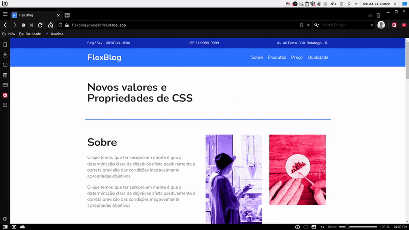

<!-- BANNER OU LOGO -->
<h1 align="center">
    
</h1>


<!-- TITULO E DESCRIÇAO -->
<div align="center">
	<h3>FlexBlog</h3>
	<p align="center">Projeto de um layout responsivo feito no curso de CSS Flexbox da Origamid utilizando apenas as propriedades do Flexbox.</p>
</div>


<!-- STATUS DO PROJETO -->
<h4 align="center"> 
	🚧 Concluido 🚧 
</h4>


## 🗒️ Conteúdo
   * [Sobre](#-Sobre)
   * [Demonstração](#-Demonstração)
   * [Tecnologias](#-tecnologias)
   * [Pré-requisitos](#-Pré-requisitos)
   * [Como rodar?](#-Rodando-a-aplicação)
   * [Autor](#-Autor)


<!-- SOBRE -->
## 📖 Sobre
Projeto desenvolvido no curso de CSS FLexBox da plataforma de estudos Origamid, utilizando apenas HTML e CSS nesse projeto eu aprendi bastante sobre os conceitos do flexbox e consegui praticar realizando esse layout totalmente responsivo e organizado, achei bastante simples e direto a forma que trabalhamos com o flexbox, muito bom !


<!-- DEMONSTRAÇÃO DA APLICAÇÃO -->
<!-- Colocar gifs e links da hospedagem -->
## 📺 Demonstração
<p align="center">
  
	
</p>
<div align="center">
<a href="https://flexblog-joaogabriel.vercel.app">Acesse a aplicação clicando aqui !</a>
</div>


<!-- TECNOLOGIAS UTILIZADAS -->
## 🛠 Tecnologias
As seguintes ferramentas foram usadas na construção do projeto:
- [HTML](https://developer.mozilla.org/pt-BR/docs/Web/HTML)
- [CSS](https://developer.mozilla.org/pt-BR/docs/Web/CSS)
	- [FlexBox](https://developer.mozilla.org/pt-BR/docs/Web/CSS/CSS_Flexible_Box_Layout/Basic_Concepts_of_Flexbox)


<!-- PRE-REQUISITOS -->
## ⚠️ Pré-requisitos
Antes de começar, você vai precisar ter instalado em sua máquina as seguintes ferramentas:
- [Git](https://git-scm.com)
- [VSCode](https://code.visualstudio.com/) (Opcional)
- [LiveServer](https://marketplace.visualstudio.com/items?itemName=ritwickdey.LiveServer). (Opcional) 


<!-- RODANDO A APLICAÇÃO -->
## 🔥 Rodando a aplicação
```bash
# Clone este repositório
$ git clone https://github.com/joaogabrieldev/FlexBlog

# Acesse a pasta do projeto no vscode ou no seu gerenciador de arquivos

# Execute o arquivo index.html com o LiveServer pelo vscode
# ou abra o arquivo index.html no seu navegador

# A aplicação iniciará localmente na sua maquina !
```


<!-- AUTOR -->
## 🤓 Autor
<div align="center" >
<a href="https://www.linkedin.com/in/joaogabrieldev/">
 
 <br />
 <b>João Gabriel</b></a> <a href="https://www.linkedin.com/in/joaogabrieldev/" title="Linkedin">🚀
</a>

Feito com ❤️ por João Gabriel 👋🏽 Entre em contato!

 [](https://www.instagram.com/joaogabriel.fn/) [](https://www.linkedin.com/in/joaogabrieldev/) [](mailto:dev.joaogabriel@gmail.com) [](https://t.me/joaogabrielfn)
	
</div>


